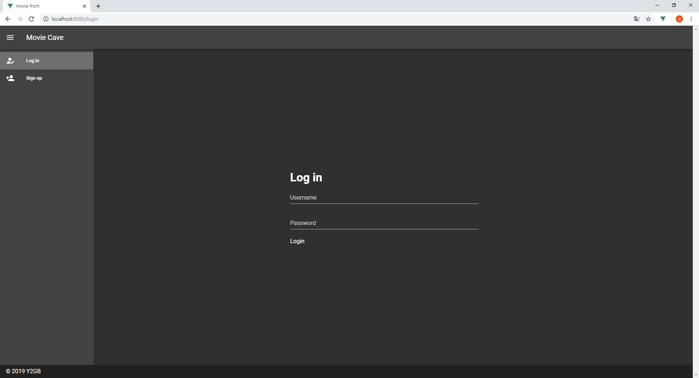
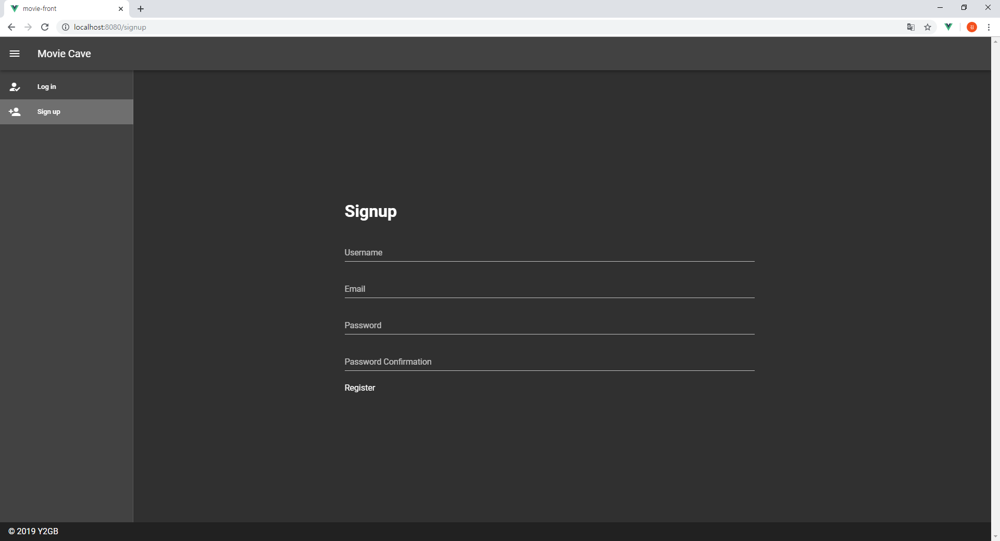
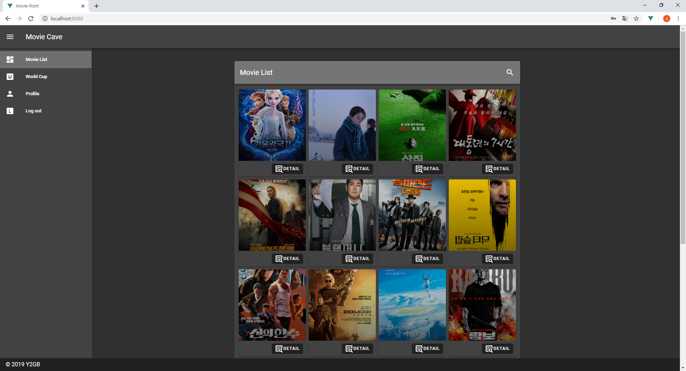
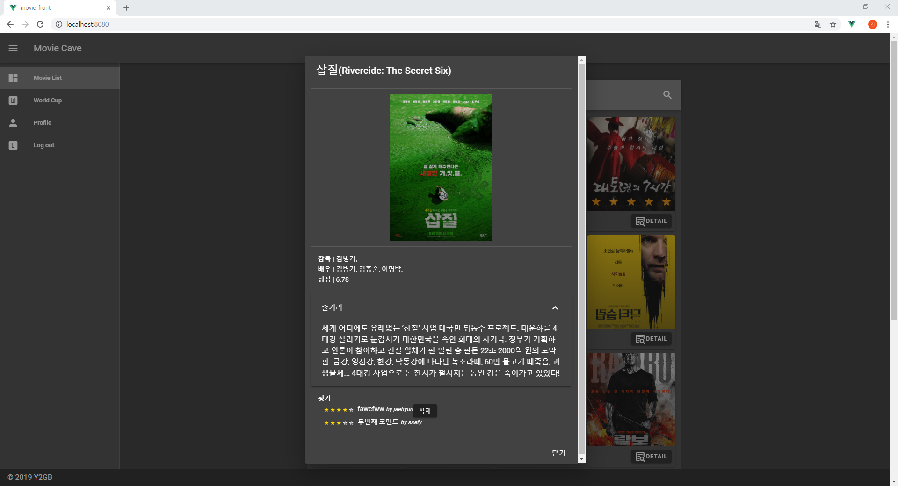
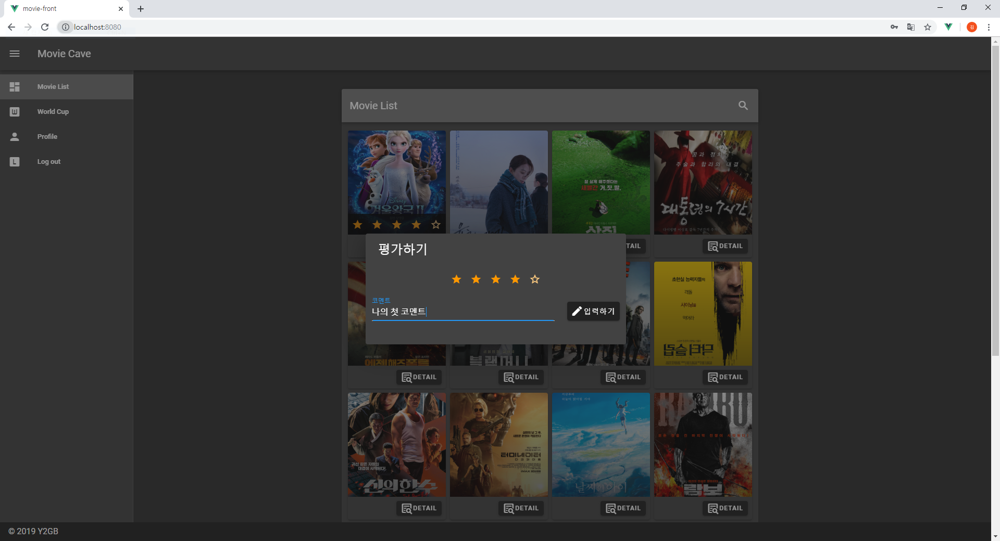
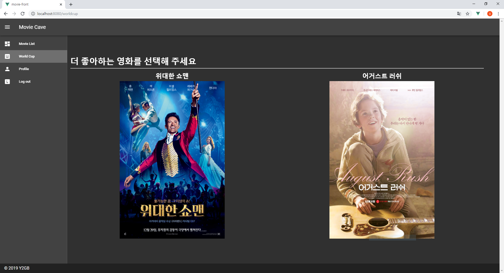

# Final Project - Movie Cave

## 1. 결과물

- Server URL

  [Back-end server](https://movie-cave.herokuapp.com)

  [Front-end server](https://movie-cave-vue.firebaseapp.com)

- Source Code (Github Flow)

  [Github Page](https://github.com/Kuhnhee/Movie-Cave-Project)


## 2. 준비 사항

1. Python Web Framework - Django
   - 가상환경 Python 3.7.4

2. Javascript Framework - Vue js

3. Server
   - Back-end: Heroku
   - Front-end: Firebaseapp


## 3. Data

#### -  Seed data

- [네이버 영화](https://movie.naver.com) 기준 1년간의 평점순(당시&종합) 상위 50개의 영화에 대한 데이터를 수집하였습니다. 

- [NAVER API](https://developers.naver.com) 와 데이터 크롤링을 통해 아래와 같은 Seed data를 수집하였습니다.

- `db.sqplite3` 에서 테이블간의 관계는 아래와 같습니다.

  - `movies/genre`

    | 필드명 | 자료형  | 설명        |
    | ------ | ------- | ----------- |
    | id     | Integer | Primary Key |
    | name   | String  | 장르 이름   |

  

  - `movies/directors`

    | 필드명      | 자료형  | 설명            |
    | ----------- | ------- | --------------- |
    | id          | Integer | Primary Key     |
    | name        | String  | 감독 이름       |
  | role        | String  | 역할            |
    | img_url     | Text    | 감독 이미지 URL |
    | description | Text    | 감독 설명       |

  
  - `movies/actors`
  
    | 필드명      | 자료형  | 설명            |
  | ----------- | ------- | --------------- |
    | id          | Integer | Primary Key     |
  | name        | String  | 배우 이름       |
    | role        | String  | 역할            |
  | img_url     | Text    | 배우 이미지 URL |
    | description | Text    | 배우 설명       |
  
  
  
  - `movies/movies`
  
    | 필드명      | 자료형  | 설명                   |
    | ----------- | ------- | ---------------------- |
    | id          | Integer | Primary Key            |
    | title       | String  | 영화 제목              |
    | title_en    | String  | 영화 영문 제목         |
    | rate        | String  | 평점                   |
    | directors   | Array   | 영화 감독들의 pk       |
    | actors      | Array   | 출연 배우들의 pk       |
    | img_url     | Text    | 영화 포스터 이미지 URL |
    | description | Text    | 영화 줄거리            |
    | open_date   | String  | 개봉일                 |
    | genres      | Array   | 영화 장르 pk 리스트    |
  
  


## 4. Back-end

#### 1.  `movies` API

```
~/api-token-auth/	jwt token
~/api/v1~		movies.url	
Auth
	/user/						- signup
	/user/user_pk/				- user info
Data (movie, genre, director, actor)
	/obj/						- object info
	/obj/obj_pk/				- object detail info
Review 
	/review/					- create review
	/review/delete/review_pk/	-delete review
	/review/movie/movie_pk/		- movie_review_set
	/review/user/user_pk/		- user_review_set
Workldcup
	/movie/list/				- random movie list
Preference
	/preference/				- update score
	/preference/user_pk			- recommand movies
```


#### 2. Response 예시

- `movie/movie_pk/`

```
{
	"pk": 171539,
	"model": "movies.movie",
	"fields": {
		"title": "그린 북",
		"title_en": "Green Book",
		"rate": "9.61",
		"directors": [
			2049
		],
		"actors": [
			2383,
			88712
		],
		"img_url": "https://movie-phinf.pstatic.net/20190115_228/1547528180168jgEP7_JPEG/movie_image.jpg",
		"description": "1962년 미국, 입담과 주먹만 믿고 살아가던 토니 발레롱가(비고 모텐슨)는 교양과 우아함 그 자체인\r 천재 피아니스트 돈 셜리(마허샬라 알리) 박사의 운전기사 면접을 보게 된다.\r \r 백악관에도 초청되는 등 미국 전역에서 콘서트 요청을 받으며 명성을 떨치고 있는 돈 셜리는\r 위험하기로 소문난 미국 남부 투어 공연을 떠나기로 결심하고,\r 투어 기간 동안 자신의 보디가드 겸 운전기사로 토니를 고용한다.\r \r 거친 인생을 살아온 토니 발레롱가와 교양과 기품을 지키며 살아온 돈 셜리 박사.\r 생각, 행동, 말투, 취향까지 달라도 너무 다른 두 사람은\r 그들을 위한 여행안내서 ‘그린북’에 의존해 특별한 남부 투어를 시작하는데…",
		"open_date": "20190109",
		"genres": [
			1
		]
	}
}
```


## 5. Front-end

```
Auth: Signup, Login, Logout
Movie: Movie List, Review, Movie detail
Profile: Movie Timeline, Review List, Recommand
Movie Worldcup: Gamification, Recommand
```


## 6. 실행 화면

1. `Login`




2. `Signup`




3. `Home`




4. `Movie Detail`




5. `Review`




6. `Worlcup`




7. `Profile`

.PNG)


